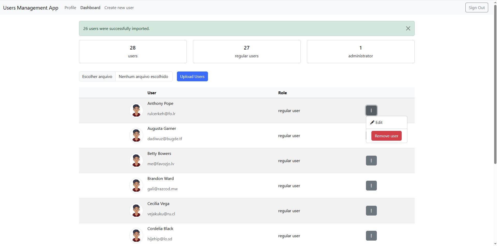
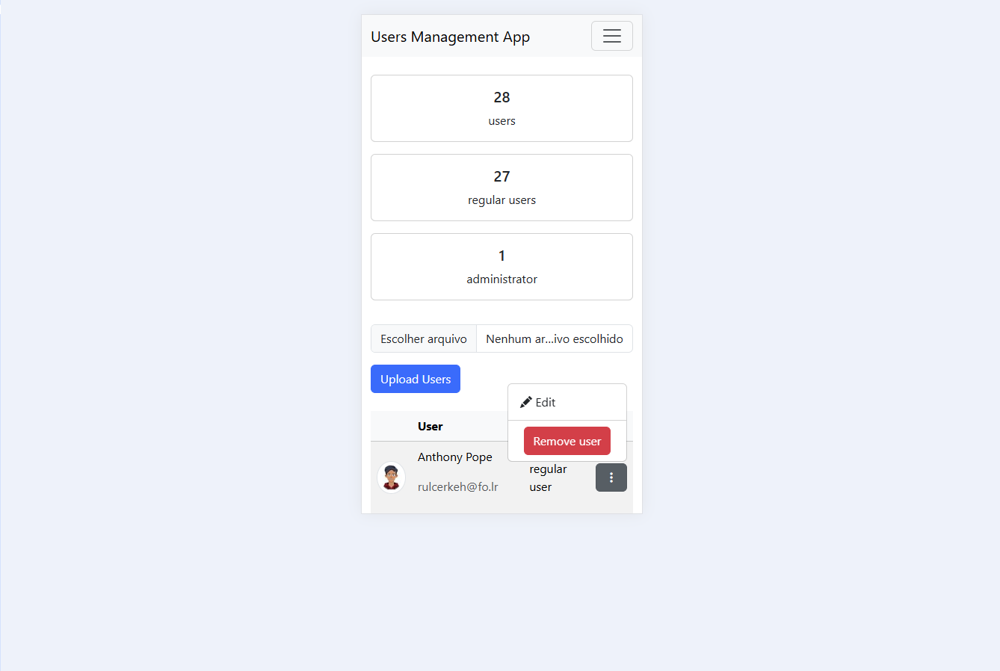

# Users Management App

Users Management App is a Ruby on Rails responsive application to manage users. This system allows:

- An Admin to access a User Admin Dashboard.
- An Admin to see on the Dashboard:
  - Total number of Users
  - Total number of Users grouped by Role
- An Admin to be redirected to the User Admin Dashboard after login.
- An Admin to list, create, edit and delete Users.
- An Admin to toggle the User Role.
- An Admin to import a Spreadsheet into the system, in order to create new Users.
- An Admin to see the progress of Users imports.
- A User to be redirected to their Profile after login.
- A User to be able only to see their info, edit and delete their profile.
- Visitors to register themselves as normal Users.





## Technologies

- Ruby 3.4.4
- Rails 8.0.2
- PostgreSQL
- RSpec and Capybara for testing
- Docker and Docker Compose
- Devise for authentication
- Bootstrap
- Pagy for pagination
- Activerecord-Import for data bulk insert


## Environment Setup

### Using DevContainer (Recommended)

The easiest way to set up the development environment is by using DevContainer, which comes with all the necessary dependencies pre-configured.

1. Install [Docker](https://www.docker.com/get-started)
2. Install [Visual Studio Code](https://code.visualstudio.com/)
3. Install the [Dev Containers](https://marketplace.visualstudio.com/items?itemName=ms-vscode-remote.remote-containers) extension in VS Code
4. Clone the repository
5. Open VS Code in this folder
6. When prompted to "Reopen in Container", click on "Reopen in Container", or use the `Remote-Containers: Reopen in Container` command in VS Code's command palette (F1)
7. VS Code will build and start the Docker container with all necessary dependencies
8. The DevContainer includes Docker CLI and GitHub CLI pre-installed and available on the PATH
9. Once inside the container, run:
   ```bash
   bin/setup
   ```

### Manual Installation

If you prefer to set up manually:

1. Install Ruby 3.4.4 (recommended to use [rbenv](https://github.com/rbenv/rbenv) or [rvm](https://rvm.io/))
2. Install PostgreSQL
3. Clone the repository and enter the folder
4. Install dependencies:
   ```bash
   bundle install
   ```
5. Set up the database:
   ```bash
   bin/rails db:create db:migrate db:seed
   ```
6. Run the tests to verify everything is working:
   ```bash
   bundle exec rspec
   ```
7. Start the development server:
   ```bash
   bin/rails s
   ```

## Running Tests

```bash
bundle exec rspec
```

## Running Linter

```bash
bin/rubocop
```

## Users CSV File

An example of csv file for the importation of users is available on `spec/fixtures/files/sample_users_file.csv`.

## Login

- Regular user: user@email.com (password: 123456)
- Administrator: admin@email.com (password: 123456)